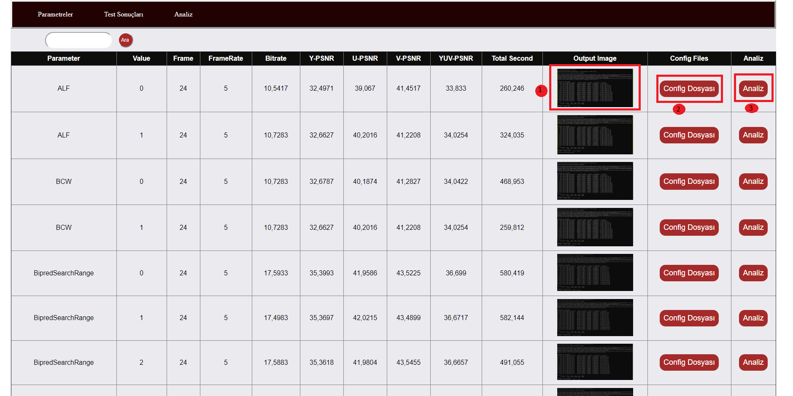
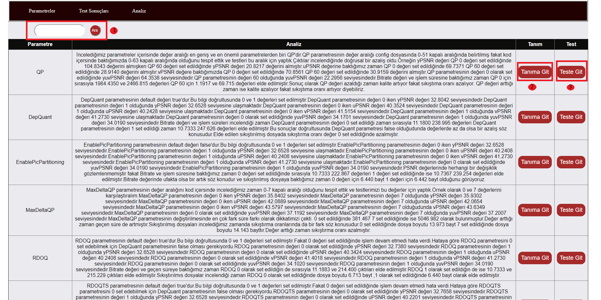

## ConfigAnalizSitesi
Projeyi geliştirme amacımız sayısal video işlemenin temelleri dersi projesi teslimi için bir format hazırlamaktı.Bu format için ise bir web sitesini uygun gördük ve asp.net ile geliştirmeye karar verdik.Veri tabanı için SQL Server 2014 kullandık.Toplamda 348 parametre araştırıldı, 40 parametre test edildi ve analizleri yapıldı.

### Geliştiriciler
- **Mehmet Emin Arslan**
- **Abdullah Emre Onur**

Görseli incelediğimiz zaman ilk sayfamız olan parametrelerin tanımlarının bulunduğu sayfayı görüyor olucaksınız.Sonuca git dediğimiz zaman eğer parametre ile ilgili bir test yapıldıysa sizi test sayfasına yönlendirir.
 
Görseli incelediğimiz zaman test sonuçlarının oluduğu sayfayı görüyoruz.1 numaralı alana baktığımız zaman tıkladığımız taktirde yapılan testin sonuçlarını ekrana getiriyoruz.2 numaralı alana baktığımız zaman test yaparken kullandığımız config dosyasını ekranda gösteriyoruz bu sayede test aşamasında kullanılan parametre değerleri detaylı olarak görülüyor.3 numaralı alana baktığımızda ise yapılan testler sonucunda yaptığımız analize yönlendiren butonu görüyoruz.

Görseli incelediğimiz zaman yaptığımız analizlerin oluduğu sayfayı görüyoruz.1 numaralı alana baktığımız zaman arama bölümünü görebilirsiniz.2 numaralı alana baktığımız zaman bizi parametrenin tanımına yönlendiren butonu görüyoruz.3 numaralı alana baktığımız zaman ise parametre ile ilgili yapılan testlerin sonuçlarına yönlendiren butonu görüyoruz.